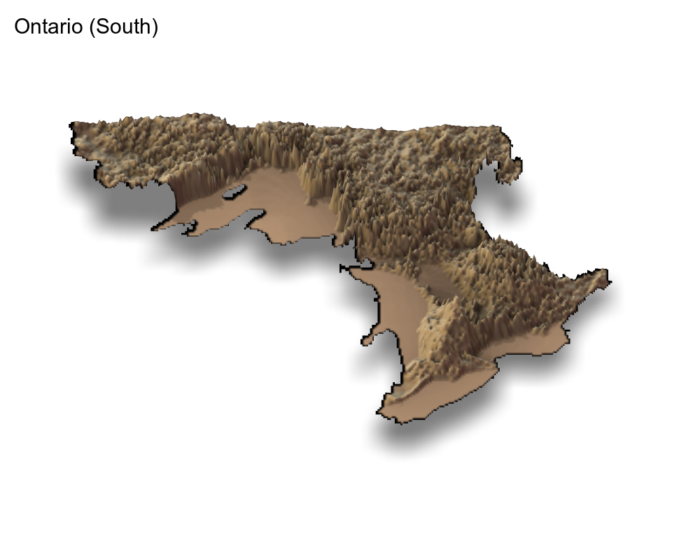

```{r setup, include=FALSE}
knitr::opts_chunk$set(echo = TRUE, warning = F, message = F, cache = T)
```


In this post I show you how to create aesthetically pleasant and useful maps in R using ground elevation data.

## Getting the Elevation Data in R

I got the elevation data from  [Geohub](https://geohub.lio.gov.on.ca/datasets/mnrf::provincial-digital-elevation-model-pdem) which provides the data for Ontario, Canada in the `.tif` format. The `.tif` file type can be easily imported in R using the `raster` package. If you want to use United States data, the [`elevatr`](https://github.com/jhollist/elevatr/) R package can help with that.  

I have downloaded 2 files for Ontario, one each for north and south Ontario, and then unzipped them. Let's start by loading the libraries and importing the data.  

```{r libsAndData}
# Load Libraries ----------------------------------------------------------

suppressPackageStartupMessages( library(raster) )
suppressPackageStartupMessages( library(tidyverse) )
suppressPackageStartupMessages( library(ggridges) )
suppressPackageStartupMessages( library(rayshader) )
suppressPackageStartupMessages( library(gganimate) )
suppressPackageStartupMessages( library(sf) )


# Load Data ---------------------------------------------------------------
ont_s <- raster("PDEM_South.tif")
# ont_n <- raster(here::here("PDEM_North.tif"))
```

Note that I used `here::here()` to get my file paths. Let's see what's in them:  


```{r exploringFiles}
ont_s
# ont_n
```

They are clearly raster file types. You can see in the `dimensions` section that the number of cells (i.e. number of data points) is quite a large number for both layers. This means that if we try to plot these data with a typical RAM size, say 8GB, we'd have a bad time^[Read the discussion here: https://stackoverflow.com/questions/61535383/r-runs-out-of-memory-plotting-data-frame-with-ggplot2].  So, to create maps we'd need to decrease the size of these raster layers.  

Before going to the next step, an important thing to note here is that the `crs` section above indicates that the units of the x, y and elevation coordinates are meters. The elevation is stored here under the names `PDEM_South` and `PDEM_North` in the two raster layers.  


## Slimming Down the Raster Data

The `sampleRegular` function from the `raster` package lets you take a sample of the original raster data by specifying the `size` argument. I experimented with different sizes, and was satisfied with `size=50000`, as it provided a good visual quality in the maps. The last argument here is `asRaster` that returns a raster data when `TRUE`.   

Once we get a reduced raster data, we use the `rayshader::raster_to_matrix()` function to put all the elevation values in a 2D matrix where the 2 dimensions are x and y coordinates. Following shows the results (only the first 5 rows and columns for each layer):  


```{r}
ont_s_m <- ont_s %>% 
  raster::sampleRegular(ont_s, size=50000, asRaster=TRUE) %>%
  rayshader::raster_to_matrix()

ont_s_m[1:5, 1:5]


# ont_n_m <- ont_n %>% 
#   raster::sampleRegular(ont_n, size=50000, asRaster=TRUE) %>%
#   rayshader::raster_to_matrix()
# 
# ont_n_m[1:5, 1:5]
```


## 3D Raster Maps with Rayshader

We use the awesome [`rayshader package`](https://github.com/tylermorganwall/rayshader) here to plot the raster map in 3D.

```{r rasterMapsTwo, eval=FALSE, include=FALSE}
ont_n_m %>%
  sphere_shade(texture = "imhof1") %>%
  add_shadow(ray_shade(ont_n_m, zscale = 30), 0.5) %>%
  add_shadow(ambient_shade(ont_n_m), 0) %>%
  plot_3d(ont_n_m, zscale = 10, fov = 0, 
          theta = 0, zoom = 0.75, phi = 70, 
          windowsize = c(1000, 800),
          solid=FALSE)
Sys.sleep(0.3)
render_snapshot(clear=T, title_text = "Ontario (North)")

rgl::rgl.close()
```


```{r rasterMapsOne}
ont_s_m %>%
  sphere_shade(texture = "desert") %>%
  add_shadow(ray_shade(ont_s_m, zscale = 30), 0.5) %>%
  add_shadow(ambient_shade(ont_s_m), 0) %>%
  plot_3d(ont_s_m, zscale = 10, fov = 0,
          theta = 0, zoom = 0.75, phi = 70,
          windowsize = c(1000, 800),
          solid=FALSE)

Sys.sleep(0.6)
render_snapshot(clear=T, title_text = "Ontario (South)",
                filename="ont_s.png")

rgl::rgl.close()

## For some reason, rayshader is not rendering the snapshot
## of this map.
```

    


## Creating Ridgeline Maps

Raster maps are beautiful but take long time to render. Another technique that can show the elevation data very effectively is a `ridgeline plot`. I was previously familiar with the [`ggridges package`](https://github.com/wilkelab/ggridges) but was recently reminded of it when I saw the ridgeline plots [app](https://anvaka.github.io/peak-map/#7.68/47.727/-122.574) made by [Andrei Kashcha](https://github.com/anvaka/peak-map). So, I decided to use elevation height in the `ggridges::geom_ridgeline()` function.  

But a ridgeline plot uses 3 arguments, x, y, and height. So, to proceed, we need to extract these coordinates from the raster files. Again, we use the `raster::sampleRegular` function for slimming the data, but also use the `xy=TRUE` option to get the three coordinates:  


```{r coordinateData}
## Sample 10000 values
df_s <- data.frame(sampleRegular(ont_s, 10000, xy=TRUE))
# df_n <- data.frame(sampleRegular(ont_n, 10000, xy=TRUE))


## Rename to 'elevation'
df_s <- df_s %>% 
  rename(elevation = PDEM_South)

# df_n <- df_n %>% 
#   rename(elevation = PDEM_North)


## Combine the two
df <- df_s#bind_rows(df_s, df_n)

head(df)
```

Note that `elevation` above is not completely `NA` (you are seeing the first 6 rows only).   


> My attempts to use `ggridges::geom_ridgeline()` were not successful. Instead, the other function, `ggridges::geom_density_ridges` is what can effectively generate the nice elevation lines for creating the 3D effect that Andrei showed. I learnt this from [Travis M. White's blogpost](https://cartographicperspectives.org/index.php/journal/article/view/1536/1726). I also found great tips for theming the map.


### Plots

The data is ready now, back to making the maps. A first try: 


```{r}
ggplot() +
  geom_density_ridges(data = df,
                      aes(x, y, 
                          group=y,
                          height = elevation),
                      stat = "identity",
                      scale=20) +
  theme_void() 

```
See the 3D effect?  

The `scale` argument controls the overlap between the ridgelines. I experimented with different values and settled with 20.  

Now with a dark theme:  

```{r}
ggplot() +
  geom_density_ridges(data = df,
                      aes(x, y, 
                          group=y,
                          height = elevation),
                      stat = "identity",
                      scale=20,
                      fill="black",
                      color="white") +
  scale_x_continuous(name = "Ontario") +
  theme_void() +
  theme(
             panel.background = element_rect(fill = "black"),
            
             plot.background = element_rect(fill = "black"),
           
             axis.title.x = element_text(colour = 'white', 
                                         size = 18))

```

For some reason, this reminded me of neon signs. So, I got an idea!


## Animating the Ridgeline Map

Let's animate the map with colors. For doing so, I create 2 more copies of the data `df` and then give one color to each (there may be a better way to do this). Then I use `transition_reveal` to color the lines turn by turn:  

```{r animate1}
colos = rep(c("red", "yellow", "green"), each = nrow(df))

retro <- bind_rows(df, df, df) %>% 
  mutate(colorz = colos)

ani1 <- ggplot(data = retro ,
       aes(x, y, 
           group=y,
           height = elevation))+
  geom_density_ridges(stat = "identity",
                      scale=20,
                      fill="black",
                      aes(color=colorz)) +
  scale_x_continuous(name = "Ontario") +
  theme_void() +
  theme(
    legend.position = "none",
    panel.background = element_rect(fill = "black"),
    
    plot.background = element_rect(fill = "black"),
    
    axis.title.x = element_text(colour = 'white', 
                                size = 18)) +
    transition_states(colorz,
                    transition_length = 2,
                    state_length = 1)

ani1
```


Of course, we can also animate by x or y dimensions:  

```{r animate2}
ani2 <- ggplot(data = df,
       aes(x, y, 
           group=y,
           height = elevation))+
  geom_density_ridges(stat = "identity",
                      scale=8,
                      fill="black",
                      color = "white") +
  scale_x_continuous(name = "Ontario") +
  theme_void() +
  theme(
    legend.position = "none",
    panel.background = element_rect(fill = "black"),
    
    plot.background = element_rect(fill = "black"),
    
    axis.title.x = element_text(colour = 'white', 
                                size = 18)) + 
  transition_manual(x, cumulative = T) + 
  ease_aes('linear')


ani2
```

This ends the blogpost. I hope you'd find something useful here for your mapping needs.
