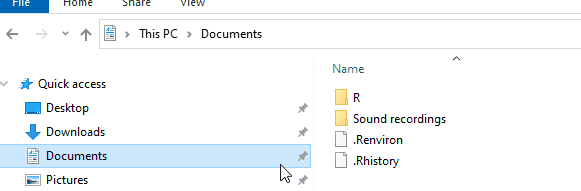

## Credit

This post is based on [Ayush Patel's post](https://ayushpatel.netlify.app/2020/12/05/the-package-patch-code-completion/) that describes the use of the `patch` package that lets you choose from a menu of character/factor values in RStudio.

# Install the `patch` package

```{r, eval=FALSE}
remotes::install_github("r-rudra/patch")
```

The [official description](https://github.com/r-rudra/patch) of the package is:

> {patch} is #rstats package for patching functions on the fly 


# Load the `patch` package

The `patch` package has a script named `usecases.R` that shows the common use cases of the package. It is located in the installed package folder as shown below:




If you open the `usecases.R` script, you'll see that contains a function called `auto_complete_dplyr_filter`, as shown in the image below:

  


Therefore, we need to load this function to get the feature of autocompleting the character or factor values in a `dplyr::filter()`:  


```{r}
source(system.file("embedded","usecases.R",package = "patch"))

library(dplyr)
```


## Autocomplete in action

Now we can easily select the desired character/factor value from the autocomplete menu. Let's first load a data set and see the factor values in it.

```{r}
data("chickwts")

chickwts
```


Now, do a filter on the `feed`:


  


And the result is:


```{r}
chickwts %>% 
  filter(feed == "linseed")
```

